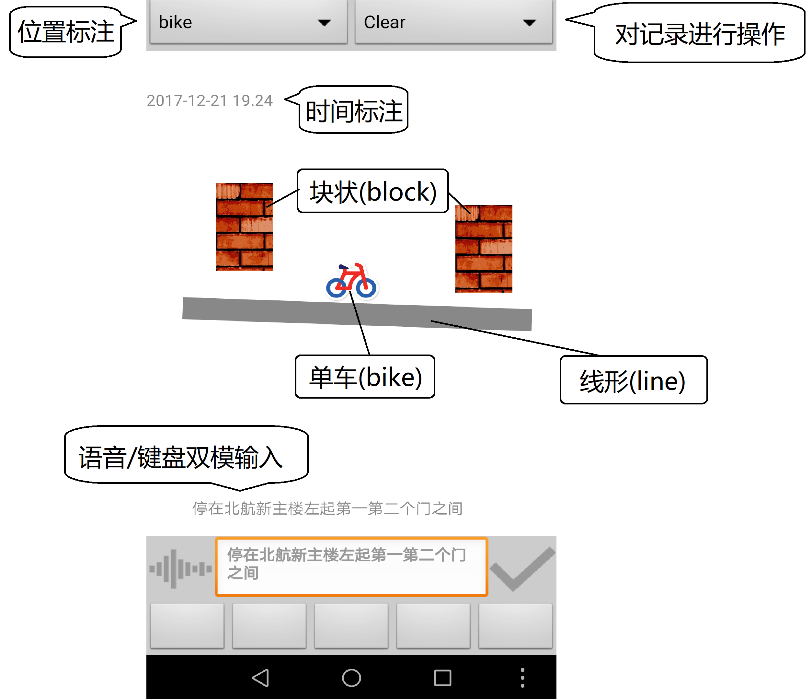

# BIKER
一款专职帮你在混乱的车堆里找到自己的自行车的安卓应用

## `页面`起始页
目前放置项目poster，未来可以用于广告位等。

## `页面`记录自行车位置
### 页面结构

### 页面功能
#### 位置标注
使用**块状(block)、线形(line)和单车(bike)** 标注物，分别在canvas中记录自行车周围的地标物、道路等线形地形与自行车所处位置。
+ __块状(block)标注物__ 
 最多有十个。每次在元素表中选定即可部署，部署后直到引入新的标注元素，均可自由调整位置
+ __线形(line)标注物__ 
 数量不限。在元素表中选定后，依照下方使用逻辑部署，部署完成后不可调整或撤销，但在部署过程中可以通过重新选定“线状标注物”回到部署该线段前的初始状态。 
*使用逻辑：*
   + 绿色（状态0）：初始状态，可以自由移动。第一次脱离与手部接触时的位置将被置为线段起点。进入状态1， 颜色变黄
   
   + 黄色（状态1）：起点已经放置，可以自由移动。在起点处会留下灰色的标记。与手部脱离接触位置时记线段终点。进入状态2， 颜色变红
   
   + 红色（状态2）：起始点均已确定，不可移动。此时若进行触摸，则将生成线段，完成部署
+ __单车(bike)标注物__ 
 一个。随时可以自由移动，用来标记目标物（自行车）位置
#### 时间标注
按照`yyyy-MM-dd HH.mm`的格式在canvas左上角保留开始新记录的时刻
#### 语音/键盘双模输入
为了保存足量相关信息，我们鼓励用户在完成图形化标注后，进行文字注释。通过点击画布左下方按钮，可以调用其它语音识别应用(部分手机需要单独安装baidu或google等的相关产品。大陆地区由于GFW，建议使用[百度语音助手](http://yuyin.baidu.com/))。完成语音输入后，用户仍可通过键盘进行补充与修改，之后通过点击canvas右下方按钮发布至canvas下方区域。
#### 对记录进行操作
+ __保存(Save)__ 
点击后，会保存包括图形标注、时间记录、文字注释等在内的画布信息，以图片形式存入手机存储。同时，我们在后台采集了此时的位置数据，以便开展基于地理位置的一系列服务
+ __清空(Clear)__ 
点击后，会清空包括图形标注、时间记录、文字注释等在内的画布信息，并初始化一条新记录
+ __加载(Load)__ 
点击后，会自动将最近的有存档的记录图片投射在画布上，方便查阅
